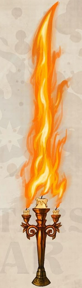

# Lumière
### Non comune, Arma (Club o Longsword)

  

**Descrizione:**
Un candelabro di bronzo con tre piccole candele quasi esauste. Si dice che fosse stato utilizzato come arma del delitto in una festa andata male e che l'anima focosa dell'uomo che è stato ucciso da esso risieda ancora al suo interno. Confortevolmente caldo al tocco, sembra impossibile capire se sia stato acceso da poco o no.

**Effetti:**
- **Luce nel Buio:** Una volta accese, le candele illuminano un'area di 10ft con la loro luce fioca, e non possono essere spente se non con mezzi magici.
- **Passione infuocata:** Alla base del candelabro è inscritto 'Lumière'. Pronunciare questa parola come azione bonus accende violentemente le candele, che eruttano una lama fiammeggiante. In questa forma, Lumière infligge 2D8 danni di fuoco e illumina fortemente per un raggio di 30ft e meno intensamente per altri 30ft. 
