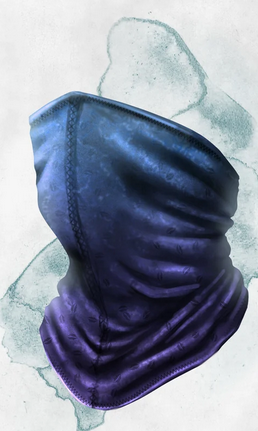

# Maschera Polivocale
### Uncomon Wondrous Item

  

**Descrizione:**
All'apparenza un semplice foulard, quando questa maschera viene avvolta sul viso permette a chi la indossa di imitare voci e suoni alla perfezione. Progettata dal maestro Cildor della Frontiera, venne usata per vincere la Battaglia di Ebron senza colpo ferire.

**Effetti:**
- **Voce Perpetua:** Indossando questa maschera, è possibile lanciare incantesimi anche sotto l'effetto di _Silenzio_. Tutti gli altri effetti di questo incantesimo restano applicati.
- **Imitatore:** Indossando questa maschera è possibile imitare qualunque suono già sentito in precedenza, incluse le voci. Una creatura che sente questi suoni può capire che sono false con un tiro di Intuizione, il cui DC è un tiro di Inganno dell'utilizzatore.
