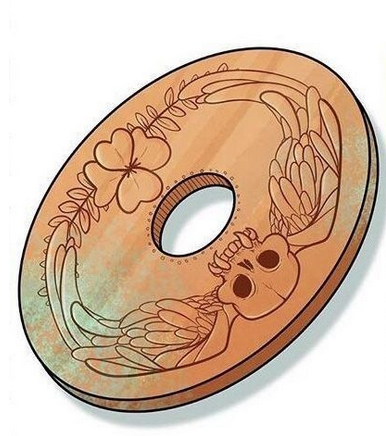

# Moneta del Tutto o Nulla
### Molto raro

  

**Descrizione:**
Un semplice gettone di bronzo con un foro al centro. Da un lato presenta un teschio con due ali che si congiungono, dall'altro un intreccio di ramoscelli che culminano in un quadrifoglio.

**Effetti:**
- **Tutto o Nulla:** Una volta per giorno, al posto di lanciare un D20 per un qualsiasi motivo, puoi lanciare questa moneta. Se esce testa, il tiro è un successo critico. Se esce croce, il tiro è un fallimento critico.
