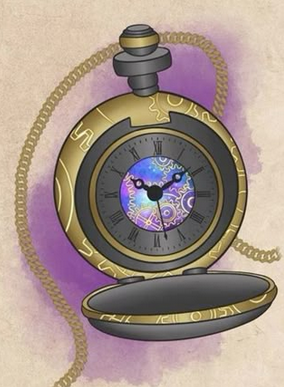

# Salvatempo
### Raro

  

**Descrizione:**
Un orologio da taschino d'oro legato a una catenella. Sul dorso presenta intricate rune circolari e, al centro del quadrante, una finestra sul Vortice Temporale.

**Effetti:**
- **Memorizzazione Attiva:** Durante un riposo (lungo o corto), è possibile memorizzare un'azione nell'orologio. Il Salvatempo può poi essere aperto come azione gratuita, causando l'avvenire dell'azione memorizzata. Il Salvatempo può memorizzare una sola azione per volta
